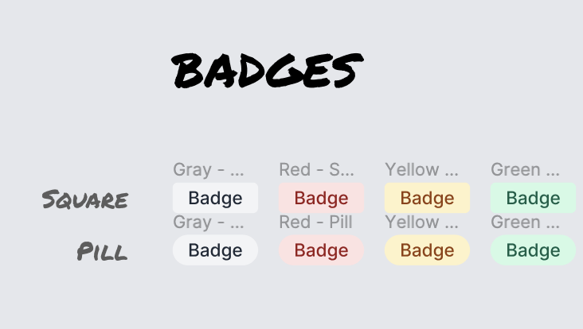
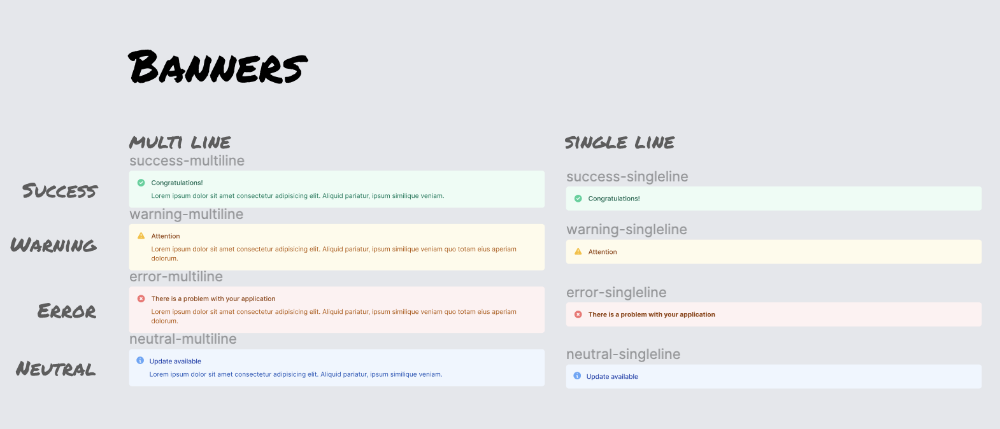
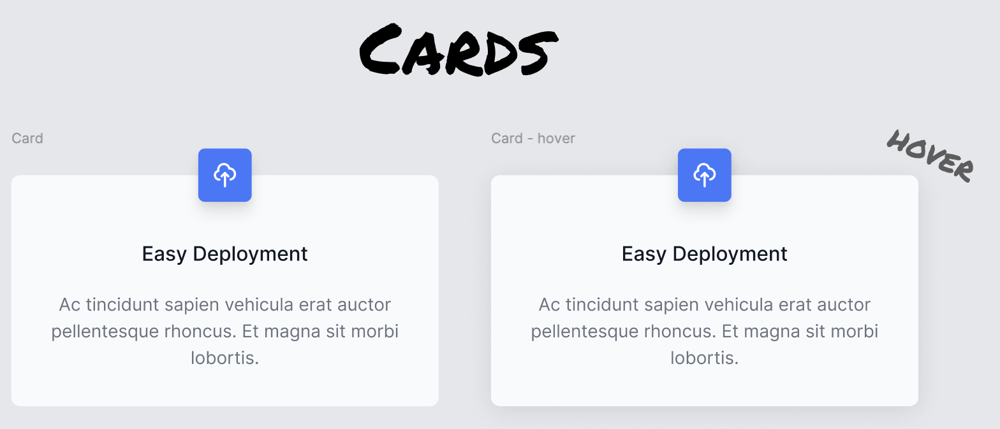
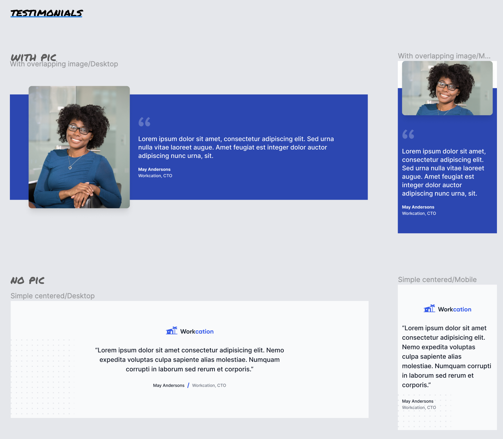
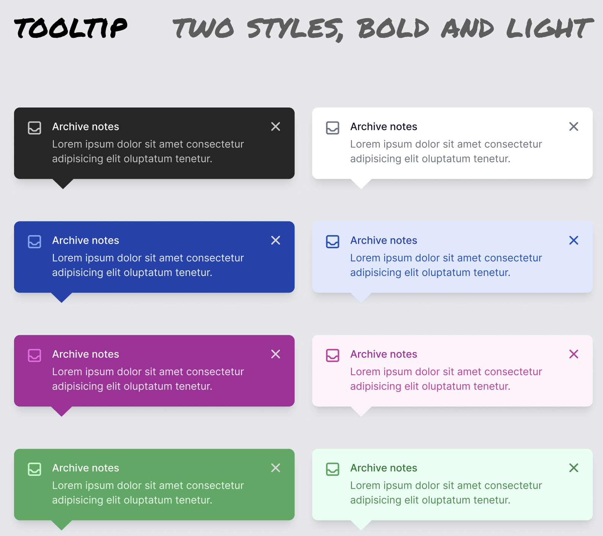
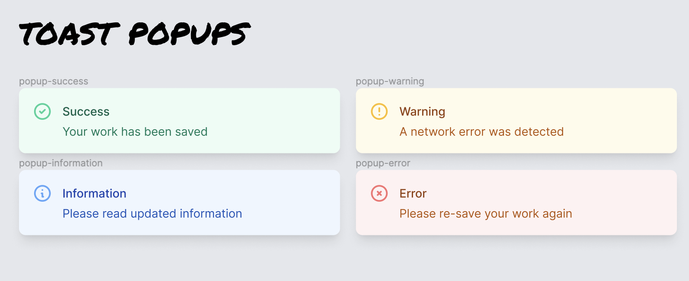

# Component Library Project for Scrimba Frontend Course

This is a library of different components built in React as part of Scrimba's Frontend Developer course.

## General Requirements
- Each component should be built using React
- Each component should be exported from its own containing folder
- Use index.jsx file or Storybook to display/test components

## Design and Component-specific requirements

### Badge

- Must allow choice of Square/Round, and Color scheme

### Banner

- Must have "Status" option (success, warning, error, neutral)
- Must have Single Line/Multi Line options
- Optionally allow displaying of child components

### Card

- Must have a hover state
- Must allow for an icon, with a default if none is provided
- Allow coloration of icon
- Allow title/text/child components

### Testimonial

- Either have 2 separate components (TestimonialWithImage, TestimonialWithoutImage) or a single component

### Tooltip

- Two styles - bold and light
- Tooltips should pop-over other elements on the page

### Toast

- Must have "Status" option (success, warning, error, neutral)
- Toast should be absolutely positioned to document body
- Positioning should be controllable
- Consider using React Portals